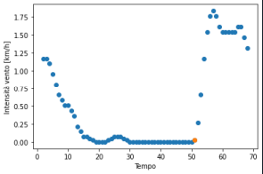
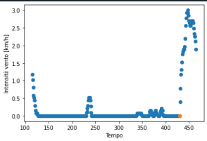

# Margherita
Analisi Raffiche Vento

Il codice analisiRaff: 
1) per finestre temporali di 15min, determina il 25-, 50- e 75-esimo percentile + media e varianza dei valori di intensità del vento
2) identifica le raffiche, ne determina la durata e l'intensità media, regolarizzando il dato tramite un filtro di media mobile, evitando così raffiche di durata troppo corta.

Scelte parametri: 
- più è alto param_1, più è forte la condizione per fare iniziare la raffica,
- più param_2 è vicino al valore 1, meno è forte la condizione per fare terminare la raffica.

Valori consigliati per i parametri: param_1 = 1.3, param_2 = 0.85

Mod 20/7/2022: 
per evitare che piccoli incrementi rendano più difficile l'identificazione della raffica, per la condizione su inizio raffica si confronta il valore attuale con una media di due valori registrati a distanza di 5s in precedenza. Inoltre: per le statistiche l'inizio della raffica è anticipato di 3s perché l'identificazione dell'inizio della raffica avviene leggermente in ritardo. 

Seguono due esempi di grafici. Vengono mostrati le intensità del vento dalla fine della raffica precedente alla fine della raffica successiva. Il puntino colorato segnala l'inizio della raffica.

